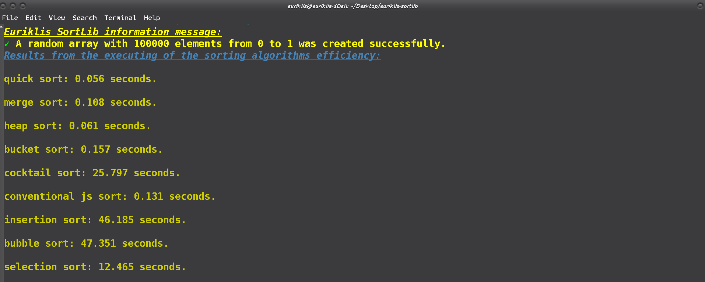
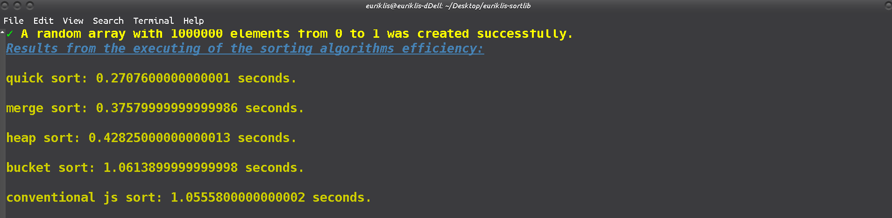

# Euriklis SORTLIB package

## Description

 The @euriklis/sortlib package is a library that contains a collection of sorting algorithms like bubble sort, heap sort, insertion sort, selection sort, merge sort, quick sort and many others algorithms. The implementation is made in such a way that the methods can be used for numerical arrays as well as for string or character arrays.

 # installation

 To install the @euriklis/sortlib package just run the command 
 ```sh
npm install @euriklis/sortlib --save
 ```
 or  for more strict mode if you wish to save the version you may use the command:

 ```sh
 npm install @euriklis/sortlib@x.x.x --save-exact
 ```
where with the "x.x.x" we denote the current version of the sortlib library

We recommend you to use the version 1.1.0 or greater versions (for more details see the technical characteristics bellow).

After series of tests we found out that the versions of @euriklis/sortlib@1.0.x are very inefficient in time and memory aspects. For this reason we unpublished these versions and now only the versions ^1.1.x are available in the npm site. The versions 1.0.x can be found in the github account which corresponds to this library.  
 
# Usage and examples:
 To declare the SortLib library/package you have to write after the installing procedure the following text into the main file:
 ```js
 const sortlib = require('@euriklis/sortlib')
 console.log(sortlib.version) // 1.1.0
 ```
 To create a SortLib instance you have to inside an object parameter into the SortLib constructor. This parameter has to contains the following properties:
 - *array* - a number or string array that will be sorted from the algorithm
 - *algorithm* - the sorting algorithm. The possible values for this property are *"merge sort"* (if the algorithm is not set, then this value is assumed by default from the constructor), *"quick sort"*, *"heap sort"*, *"insertion sort"*, *"selection sort"*, *"bubble sort"*, *"bucket sort"* and "cocktail sort". The first three are fast sorting algorithms (complexity of order O(nlogn)) and the rest of the other algorithms have complexity > O(n<sup>2</sup>).
 - *sort mode* - if the user would like to sort the array in ascending order, then he/she has to set the ***sort mode*** property to *'increase'* or *true*. The constructor assumes by default that this property is set to true if is missed. If on the other hand we want to sort the array property in descending order then the value of the ***sort mode*** property has to be set to 'decrease' or false.
 - status - if the user wants to declare that the array property which is inserted is sorted then he/she can set the status property to 'sorted'. The constructor sets by default this property to 'unsorted'. When the user uses the *sort()* method, then the value of this property changes automatically to 'sorted'.
 ```js
 const sortlib = require('@euriklis/sortlib')
 const sortlib_instance = new sortlib({
     array : [1, 8, 3, 7, 4, 2, 5, 6],
     algorithm : 'merge sort', 
     // as well as "quick sort", "heap sort", "insertion sort",
     // "bubble sort" and "selection sort"
     "sort mode" : 'increase' // or alternatively true for
     // ascending order sorting and 'decrease' or false for
     // descending order sorting of the array
 })
 ```
 The constructor creates automatically the property "indices" that is an array that shows the order or the index of every element of the array. When the element position changes by the sorting procedure, then the indices property changes the position of the index of this element. In fact we need to create just the array parameter and all other parameters can be set automatically from the constructor of the SortLib class. 
 If we want to use just the sorting algorithms without creating of any instance, then we may use the static methods of the package. Note that when you creates a SortLib instance, then the constructor automatically checks the validity of each element (i.e. if the array is an array of number of value elements).
 The SortLib static methods are the following:
 - *SortLib.addElementInSortedArray(array, element)* - this method ***assumes*** that the array is number or string array that is already sorted and put an arbitrary element (number or string value) to the existed array. The method computes automatically the mode of the ordering of the array (ascending of descending). Note that the returned result is an SortLib object.For example:
 ```js
 const sortlib = require('@euriklis/sortlib')
 const array = [1, 2, 3, 4,  5, 6]
 const extended_array = sortlib.addElementInSortedArray(array, 7)
 console.log(extended_array.array) // [1, 2, 3, 4, 5, 6, 7]
 ```
 - *SortLib.merge_sort(array, mode)* - the method assumes that the array is a number or string value array and the mode is set to true ("increase") if is not declared. The method implements the merge sort algorithm. Note that the returned result is an object with properties "array" that is the sorted array and "indices" that is an array with the index positions of the sorted elements in the initial array. The algorithm does not uses recursion and copies the elements of the initial array two times. This copy procedure is the reason for the delaying of the algorithm in comparison with the quick sort. However, for large scale arrays this method is efficient because of the intrinsic stability.
```js
const sortlib = require('@euriklis/sortlib')
const array = [19, 3, 38, 2, 14, 6, 48, 32, 12, 5]
const sorted_array = sortlib.merge_sort(array)
const inverse_sorted_array = sortlib.merge_sort(array, false)// or "decrease"
console.log(sorted_array)
/**
 * { 
 *    array: [ 2, 3, 5, 6, 12, 14, 19, 32, 38, 48 ],
 *    indices: [ 3, 1, 9, 5, 8, 4, 0, 7, 2, 6 ] 
 * }
 **/
console.log(inverse_sorted_array)
/**
 *{ 
 *    array: [ 48, 38, 32, 19, 14, 12, 6, 5, 3, 2 ],
 *   indices: [ 6, 2, 7, 0, 4, 8, 5, 9, 1, 3 ] 
 * } 
 **/
```
- *SortLib.quick_sort(array, mode)* - this method implements the quick sort algorithm. Note that this algorithm is fast (complexity O(nlogn)) and is implemented without using of recursion. The array parameter has to be a number or string array and the mode is a boolean or string variable with possible values "decrease" and "increase". By default the method assumes that the mode is set to "increase"/true. Note that the method returns an object with properties "array" and "indices" which represent the sorted array and the index position of the elements in the initial array. For example:
```js
const sortlib = require('@euriklis/sortlib')
const array = [3, 61, 23, 13, 87, 19, 185, 2, 26, 5]
const output = sortlib.quick_sort(array)// or ...quick_sort(array, true)
const reversed_output = sortlib.quick_sort(array, false) // or "decrease"
console.log(output)
=> { 
    array: [ 2, 3, 5, 13, 19, 23, 26, 61, 87, 185 ],
    indices: [ 7, 0, 9, 3, 5, 2, 8, 1, 4, 6 ] 
}
console.log(reversed_output)
=> { 
    array: [ 185, 87, 61, 26, 23, 19, 13, 5, 3, 2 ],
    indices: [ 6, 4, 1, 8, 2, 5, 3, 9, 0, 7 ] 
}
```
- *SortLib.heap_sort(array, mode)* -  this method implements the heap sort algorithm. From version 1.1.0 the method does not use internal functions for the sorting procedure and in particular the utility functions ***shift_down*** and ***heap_shift_down*** which are widely used in the implementation of this family of sorting algorithms are avoided because of the more efficient execution of the algorithm. The parameter "array" has to be a number or string array and the "mode" as in the other cases noted above, is a boolean or a string variable with the only possible values "increase" and "decrease", when the parameter is of string type. For example:
```js
const sortlib = require('@euriklis/sortlib')
const array = [1, 4, 2, 98, 32, 24, 42, 18, 3, 48, 21]
const output = sortlib.heap_sort(array)
const reversed_output = sortlib.heap_sort(array, "decrease") 
// or false alternatively
console.log(output)
=> { 
    array: [ 1, 2, 3, 4, 18, 21, 24, 32, 42, 48, 98 ],
    indices: [ 0, 2, 8, 1, 7, 10, 5, 4, 6, 9, 3 ] 
}
console.log(reversed_output)
=> { 
    array: [ 98, 48, 42, 32, 24, 21, 18, 4, 3, 2, 1 ],
    indices: [ 3, 9, 6, 4, 5, 10, 7, 1, 8, 2, 0 ] 
}
```
- *SortLib.insertion_sort(array, mode)* - this method implements the insertion sort algorithm. Note that the algorithm has non linear complexity (0(n<sup>2</sup>)). The array and the mode parameters represent the same values as in the strict methods above. For example:
```js
const SortLib = require('@euriklis/sortlib')
const array = [12, 1, 54, 34, 67, 13, 109, 32, 88]
const output = SortLib.insertion_sort(array)
const reversed_output = SortLib.insertion_sort(array, false)
console.log(output)
=> { 
    array: [ 1, 12, 13, 32, 34, 54, 67, 88, 109 ],
    indices: [ 1, 0, 5, 7, 3, 2, 4, 8, 6 ] 
}
console.log(reversed_output)
=> { 
    array: [ 109, 88, 67, 54, 34, 32, 13, 12, 1 ],
    indices: [ 6, 8, 4, 2, 3, 7, 5, 0, 1 ] 
}
```
- *SortLib.bubble_sort(array, mode)* - this method implements the bubble sort algorithm. The method does not uses recursion. The "array" and "mode" parameters represent the same values as in the strict methods above.
```js
const SortLib = require('@euriklis/sortlib')
const array = [2, 18, 3, 84, 24, 13, 1, 42, 21, 11]
const output = SortLib.bubble_sort(array)
const reversed_output = SortLib.bubble_sort(array, false)
console.log(output)
=> { 
    array: [ 1, 2, 3, 11, 13, 18, 21, 24, 42, 84 ],
    indices: [ 6, 0, 2, 9, 5, 1, 8, 4, 7, 3 ] 
}
console.log(reversed_output)
=> { 
    array: [ 84, 42, 24, 21, 18, 13, 11, 3, 2, 1 ],
    indices: [ 3, 7, 4, 8, 1, 5, 9, 2, 0, 6 ] 
}
```
- *SortLib.selection_sort(array, mode)* - this method implements the selection sort algorithm. The "array" and "mode" parameters represent the same values as in the strict methods above.
```js
const SortLib = require('@euriklis/sortlib')
const array = [4, 1, 5, 35, 9, 289, 3, 24, 14, 21, 6, 28]
const output = SortLib.selection_sort(array)
const reversed_output = SortLib.selection_sort(array, false)
console.log(output)
=> { 
    array: [ 1, 3, 4, 5, 6, 9, 14, 21, 24, 28, 35, 289 ],
    indices: [ 1, 6, 0, 2, 10, 4, 8, 9, 7, 11, 3, 5 ] 
}
console.log(reversed_output)
=> { 
    array: [ 1, 3, 4, 5, 6, 9, 14, 21, 24, 28, 35, 289 ],
    indices: [ 1, 6, 0, 2, 10, 4, 8, 9, 7, 11, 3, 5 ] 
}
```
- *SortLib.cocktail_sort(array, mode)* - implementation of the cocktail sort algorithm. Note that this algorithm is not fast and has complexity proportional to O(n<sup>2</sup>). The array and the mode parameters represents the same values as was noticed above. The method is available from version 1.0.2.
```js
const SortLib = require('@euriklis/sortlib')
const validator = require('@euriklis/validator')
const array = [45, 1, 5, 2, 423, 23, 21, 55, 16, 24, 67]
const sorted_array = [1, 2, 5, 16, 21, 23, 24, 45, 55, 67, 423]
const output = SortLib.cocktail_sort(array)
const reversed_output = SortLib.cocktail_sort(array, false)
const sort_lib_instance = new SortLib()
sort_lib_instance.array = array
sort_lib_instance.algorithm = 'cocktail sort'
sort_lib_instance["sort mode"] = true
sort_lib_instance.sort()
const reversed_instance = new SortLib()
reversed_instance.array = array
reversed_instance.algorithm = 'cocktail sort'
reversed_instance['sort mode'] = false
reversed_instance.sort() 
new validator(output.array).is_same(sorted_array)
    .and().bind(
        new validator(reversed_output.array).is_same([...sorted_array].reverse())
    )
    .and().bind(
        new validator(sort_lib_instance.array).is_same(sorted_array)
    )
    .and().bind(
        new validator(reversed_instance.array).is_same([...sorted_array].reverse())
    )
    .on(true, () => console.log(true) )
    .on(false, () => console.log(false))
```   
- *SortLib.bucket_sort(array, buckets, sort_mode)* - this method implements the bucket sort algorithm. Note that this method theoretically is not fast and has worst complexity O(n<sup>2</sup>) and average time complexity O(2 * n + n<sup>2</sup> / k + k), where the k is the number of the buckets. The buckets are lists in which the elements of the array have to be passed. Note that the number of the buckets can not be higher than the length of the array. In the case that the buckets are not declared the method automatically sets this parameter to floor (array.length / 2). In the case in which the number of the buckets is bugger than the length of the array, then the buckets will be set to the length of the array. It is important that this method can be executed only for number arrays. The method is available form version 1.0.3 and higher versions.
```js
const validator = require('@euriklis/validator')
const SortLib = require('@euriklis/sortlib')
let array = [12, 2, -21, 32,1.2, 43, 5, 3],
    sorted_array = [-21, 1.2, 2, 3, 5, 12, 32, 43],
    output = SortLib.bucket_sort(array, 3, true),
    reversed_output = SortLib.bucket_sort(array, 3, false)
new validator(output.array).is_same(sorted_array)
    .and().bind(
        new validator(reversed_output.array).is_same([...sorted_array].reverse())
    )
    .on(true, () => console.log('Correctly sorted array with bucket sort static method bucket_sort()'))
    .on(false, () => console.error('Error in the execution of the bucket sort algorithm from the static method bucket_sort().'))
```
- *SortLib.generate_random_array(length, seed)* - this is an utility method, which creates an array of uniform distributed random values from 0 to 1 with length the first parameter of the method and uses optionally seed parameter. We use the idea of the John Burkardt Fortran routine used in complex constrained optimization method of M.J.Box. The method is available from version 1.1.0 of the package.  

- *SortLib.find_best_elements(array, n)* - this method is available from the version 1.1.0 or higher version of the package. The array may be a number value array as well as a string value array. The method is fast and uses the heap_sort() method to detect the highest elements of the array. The n parameter has to be an integer form 1 to the length of the array or a floating point number in the interval (0, 1). When the n is float type number, then the method returns the first 100 * n% best elements of the array. This method is created/oriented for using in evolutionary/genetic based algorithms, where is needed to be chosen a set of values that ensure the best/highest value of an objective function. An example that shows how to use this method is:
```js
const SortLib = require('@euriklis/sortlib')
const random_array = SortLib.generate_random_array(50)
const bestTen = SortLib.find_best_elements(random_array, 10)
```
- *SortLib.find_worst_elements(array, n)* - this method is the inverse method of the previous method. The method uses the same algorithm (heap sort) and returns the n smallest values, where as above the array can be a number or string array and the n can be an integer number from 1 to the length of the array or a float number from 0 to 1. For example:

```js
const SortLib = require('@euriklis/sortlib')
const random_array = SortLib.generate_random_array(50)
const worstTen = SortLib.find_worst_elements(random_array, 10)
```
- *SortLib.sort_object_array_by_property(array, property, mode, algorithm)* - this method is available from version 1.1.0 or a higher version of the package. The method assumes that the array is an array with all elements to be of object type. If this condition is not fulfilled, then an error message for incorrect array will be thrown. The property can be a string value or an array of string elements that have to be keys of each array element of the array parameter. If this condition is not fulfilled, then an error message for incorrect property parameter will be thrown from the method. The method sorts the elements of the array (objects) by the value of the property key (if the property is an array then the value of the key of the last depth of the object element). For example let us assume a graph object. It is well known that every graph has nodes and edges and every edge has a weight. To sort the edges we have to execute the following code:
```js
const SortLib = require('@euriklis/sortlib')
const Graph = {
    attributes : {},
    nodes : Array.from({length : 100}).map((el, i) => {
        return {
            name : `v${i + 1}`,
            value : Math.random()
        }
    }),
    edges : Array.from({length : 10000}).map((w, i) => {
        return {
            source : `v${((i + 1) / 100) | 0}`,
            target : `v${((i + 1) % 100)}`,
            attributes : {
                weight : Math.random(),
                color : `rgb(${Math.random() * 255 | 0},${Math.random() * 255 | 0},${Math.random() * 255 | 0})`
            }
        }
    })
}
// set the edges by the weight value
Graph.edges = SortLib.sort_object_array_by_property(Graph.edges, ['attributes', 'weight']).array // the method returns the array and the indices of the initial array.
// set the nodes by the their value
Graph.nodes = SortLib.sort_object_array_by_property(Graph.nodes, 'value', true, 'quick sort').array // if we want to declare the sorting algorithm
```
The possible values for the algorithm parameter are all fast algorithms and the bucket sort. 

- *SortLib.find_best_for_object_array_by_property(array, property, n)* and *SortLib.find_worst_for_object_array_by_property(array, property, n)* - these methods are available from version 1.1.0 and higher versions of the package. The methods sorts an array of objects by given property of the object that has to be number or string (in the last level of the object, when the property is string array of the keys of the object element). If we have the same Graph which was created above, we may extract the ten weights with higher values by this way:
```js
const topTenWeights = SortLib.find_best_for_object_array_by_property(Graph.edges, ['attributes', 'weight'], 10).array
```


The SortLib package can run any of these methods shown above when the array parameter of the current instance is declared. This can be done with the using of the sort() method of the SortLib package/library. 
```js
const SortLib = require('@euriklis/sortlib')
const array = [4, 1, 5, 35, 9, 289, 3, 24, 14, 21, 6, 28]
const sortlib_instance = new SortLib({array})
// the unsorted array
console.log(sortlib_instance)
sortlib_instance.algorithm = 'quick sort'
// the sorted array with the quick sort algorithm
sortlib_instance.sort()
console.log(sortlib_instance)
// reset the array and apply the
// insertion sort algorithm.
sortlib_instance.algorithm = 'insertion sort'
sortlib_instance.status = 'unsorted'
sortlib_instance.array = array
sortlib_instance.sort()
// the sorted array with the insertion sort
// algorithm...
console.log(sortlib_instance)
sortlib_instance.algorithm = 'bubble sort'
sortlib_instance.status = 'unsorted'
sortlib_instance.sort()
console.log(sortlib_instance)
=> SortLib {
  __array__: [ 4, 1, 5, 35, 9, 289, 3, 24, 14, 21, 6, 28 ],
  __size__: 12,
  __algorithm__: 'merge sort',
  __sort_mode__: 'increase',
  __status__: 'unsorted',
  __indices__: [ 0, 1, 2, 3, 4, 5, 6, 7, 8, 9, 10, 11 ] }
SortLib {
  __array__: [ 1, 3, 4, 5, 6, 9, 14, 21, 24, 28, 35, 289 ],
  __size__: 12,
  __algorithm__: 'quick sort',
  __sort_mode__: 'increase',
  __status__: 'sorted',
  __indices__: [ 1, 6, 0, 2, 10, 4, 8, 9, 7, 11, 3, 5 ] }
SortLib {
  __array__: [ 1, 3, 4, 5, 6, 9, 14, 21, 24, 28, 35, 289 ],
  __size__: 12,
  __algorithm__: 'insertion sort',
  __sort_mode__: 'increase',
  __status__: 'sorted',
  __indices__: [ 1, 6, 0, 2, 10, 4, 8, 9, 7, 11, 3, 5 ] }
SortLib {
  __array__: [ 1, 3, 4, 5, 6, 9, 14, 21, 24, 28, 35, 289 ],
  __size__: 12,
  __algorithm__: 'bubble sort',
  __sort_mode__: 'increase',
  __status__: 'sorted',
  __indices__: [ 0, 1, 2, 3, 4, 5, 6, 7, 8, 9, 10, 11 ] }
```
To get or set the identical properties of the SortLib instance you have to use the get and set methods *array* , *size* (only getting mode), *algorithm* (if you try to set the algorithm to not supported for the library value, then the algorithm will be set automatically to "merge sort"), *sort mode* (getter and setter methods), *status* (getter and setter methods. The only supported values are 'sorted' and 'unsorted') and *indices* (getter and setter methods).

# Technical information and details
For more time and memory efficiency we implement all fast sorting algorithms without internal functions and without recursions. Also in the copy  procedure of the arrays we avoid to use the javascript spread operator (...). The copy of the elements is made with bitwise operations and shifting techniques. For example we can realize a copy of an arbitrary array with random number elements by following alternative methods:*
1. *Very inefficient way:*
```js
let n = 100, array = Array.from({length : n}).map(Math.random), copied_array
copied_array = [...array]
```
2. *Inefficient way:*
```js
let i, n = 100, array = Array.from({length : n}).map(Math.random), copied_array = []
for (i = 0;i < n;i++) copied_array[i] = array[i]
```
3. *Efficient form*:
```js
let i, n = 100, array = Array.from({length : n}).map(Math.random)
for (i = 0;i < n >> 1;i++) {
    copied_array[i << 1] = array[i << 1]
    copied_array[(i << 1) + 1] = array[(i << 1) + 1]
}
if (n & 1) copied_array[n - 1] = array[n - 1]
```
In our library we use two bits shifting for the copy procedures and the loops which allows that technique.
We also use the minimum count of variables and simulate the multiplication with bitwise techniques when this is possible.
All algorithms and the theoretical basis for the implementation of the library are taken from the book of Manolis Loukakis "Data structures. Algorithms", Thessaloniki, 1998, Sofia press.  
# Why to use this package?
This package is constructed and designed for the needs of efficient sorting of number or string arrays/lists. It is well known that the javascript language provides a conventional way for sorting of arrays. But because of the generality of the nature of the arrays, the method ___sort()___ of javascript is very inefficient and unstable when we need fast sorting of number or character/string arrays. For that reason we created this library in order to implements the crucial sorting algorithms merge sort, quick sort, heap sort, bucket sort and the conventional algorithms bubble sort, insertion sort, selection sort, cocktail sort and a dozen of other useful algorithms that may be used for the needs of the econometric or AI package construction or simply for experimental needs like testing of the efficiency of the sorting algorithms for small random arrays, medium random arrays, large random arrays and extremely large random arrays, extracting of sorted object patterns and etc. 

To demonstrate the time efficiency of the SortLib library we present the results that was obtained from the comparison of the SortLib algorithms with the conventional javascript method ___sort()___. First of all for medium arrays (in our case a random array form 100000 number elements) we observe that the most efficient algorithm is the quick sort, followed from the heap sort and then the merge sort, the conventional javascript algorithm and finally the bucket sort. Concretely for 1 experiment for an array of 100000 random number elements we obtain:
```js
'use strict'
const message = require('@euriklis/message')
function ComparisonSortLibAndSort() {
    let answer = false, elements = 100000, iterations = 1,
        dt1, dt2, qs_time = 0, ms_time = 0, hs_time = 0, bs_time = 0,
        bub_time = 0, convent_time = 0, cs_time = 0, is_time = 0,
        sels_time = 0
    const validator = require('@euriklis/validator')
    const SortLib = require('@euriklis/sortlib')
    const array = SortLib.generate_random_array(elements, 123456)
    const conventional_sorting = function (array, mode) {
        if (typeof mode === 'undefined') mode = true
        if (mode === 'decrease') mode = false
        const n = array.length
        let i, sorted_array = []
        for (i = 0; i < n >> 2; i++) {
            sorted_array[i << 2] = array[i << 2]
            sorted_array[(i << 2) + 1] = array[(i << 2) + 1]
            sorted_array[(i << 2) + 2] = array[(i << 2) + 2]
            sorted_array[(i << 2) + 3] = array[(i << 2) + 3]
        }
        if ((n % 4) >= 1) {
            sorted_array[n - 1] = array[n - 1]
        }
        if ((n % 4) >= 2) {
            sorted_array[n - 2] = array[n - 2]
        }
        if ((n % 4) >= 2) {
            sorted_array[n - 3] = array[n - 3]
        }
        return mode ? sorted_array.sort((a, b) => a - b) : sorted_array.sort((a, b) => b - a)
    }
    console.clear()
    new message().bold().set_color_green().append_check_mark().append_white_space()
        .set_color_yellow().append(`A random array with ${elements} elements from 0 to 1 was created successfully.`).reset().log()
    let sorted_array_qs, sorted_array_ms, sorted_array_cs, sorted_array_bubs,
        sorting_array_conventionally, sorted_array_hs, sorted_array_is, sorted_array_bcs,
        sorted_array_sels, i

    new message().bold().italic().underline().set_color_blue()
        .append('Results from the executing of the sorting algorithms efficiency:\n')
        .reset().log()
    for (i = 0; i < iterations; i++) {
        dt1 = Date.now()
        sorted_array_qs = SortLib.quick_sort(array).array
        dt2 = Date.now()
        qs_time += (dt2 - dt1) / iterations
    }
    new message()
        .set_color_yellow()
        .append(`quick sort: ${qs_time / 1000} seconds.\n`).reset().log()
    for (i = 0; i < iterations; i++) {
        dt1 = Date.now()
        sorted_array_ms = SortLib.merge_sort(array).array
        dt2 = Date.now()
        ms_time += (dt2 - dt1) / iterations
    }
    new message().set_color_yellow()
        .append(`merge sort: ${ms_time / 1000} seconds.\n`).reset().log()
    for (i = 0; i < iterations; i++) {
        dt1 = Date.now()
        sorted_array_hs = SortLib.heap_sort(array).array
        dt2 = Date.now()
        hs_time += (dt2 - dt1) / iterations
    }
    new message().set_color_yellow()
        .append(`heap sort: ${hs_time / 1000} seconds.\n`).reset().log()

    for (i = 0; i < iterations; i++) {
        dt1 = Date.now()
        sorted_array_bcs = SortLib.bucket_sort(array).array
        dt2 = Date.now()
        bs_time += (dt2 - dt1) / iterations
    }
    new message().set_color_yellow()
        .append(`bucket sort: ${bs_time / 1000} seconds.\n`).reset().log()
    
    for (i = 0; i < iterations; i++) {
        dt1 = Date.now()
        sorted_array_cs = SortLib.cocktail_sort(array).array
        dt2 = Date.now()
        cs_time += (dt2 - dt1) / iterations
    }
    new message().set_color_yellow()
        .append(`cocktail sort: ${cs_time / 1000} seconds.\n`).reset().log()
    
    for (i = 0; i < iterations; i++) {
        dt1 = Date.now()
        sorting_array_conventionally = conventional_sorting(array)
        dt2 = Date.now()
        convent_time += (dt2 - dt1) / iterations
    }
    new message().set_color_yellow()
        .append(`conventional js sort: ${convent_time / 1000} seconds.\n`).reset().log()
    
    for (i = 0; i < iterations; i++) {
        dt1 = Date.now()
        sorted_array_is = SortLib.insertion_sort(array).array
        dt2 = Date.now()
        is_time += (dt2 - dt1) / iterations
    }
    new message().set_color_yellow()
        .append(`insertion sort: ${is_time / 1000} seconds.\n`).reset().log()
    
    for (i = 0; i < iterations; i++) {
        dt1 = Date.now()
        sorted_array_bubs = SortLib.bubble_sort(array).array
        dt2 = Date.now()
        bub_time += (dt2 - dt1) / iterations
    }
    new message().set_color_yellow()
        .append(`bubble sort: ${bub_time / 1000} seconds.\n`).reset().log()
    for (i = 0; i < iterations; i++) {
        dt1 = Date.now()
        sorted_array_sels = SortLib.selection_sort(array).array
        dt2 = Date.now()
        sels_time += (dt2 - dt1) / iterations
    }
    new message().set_color_yellow()
        .append(`selection sort: ${sels_time / 1000} seconds.\n`).reset().log()
        
    new validator(sorting_array_conventionally).is_same(sorted_array_ms)
        .and().bind(
            new validator(sorting_array_conventionally).is_same(sorted_array_qs)
        )
        .and().bind(
            new validator(sorting_array_conventionally).is_same(sorted_array_bubs)
        )
        .and().bind(
            new validator(sorting_array_conventionally).is_same(sorted_array_bcs)
        )
        .and().bind(
            new validator(sorting_array_conventionally).is_same(sorted_array_is)
        )
        .and().bind(
            new validator(sorting_array_conventionally).is_same(sorted_array_cs)
        )
        .and().bind(
            new validator(sorting_array_conventionally).is_same(sorted_array_hs)
        )
        .on(true, () => console.log(answer = true))
        .on(false, () => {
            throw new Error('Incorrect comparison or internal error into the sorting algorithms of SortLib.')
        })
```
output:


The paradigm for the large scale arrays (1000000 elements) is a little bit different. The mean results which was obtained for 100 sorting procedures show that the quick sort and merge sort are the most efficient algorithms, followed from the heap sort, the traditional javascript sorting method and the bucket sort. 
```js
'use strict'
const message = require('@euriklis/message')
function ComparisonSortLibAndSort() {
    let answer = false, elements = 1000000, iterations = 100,
        dt1, dt2, qs_time = 0, ms_time = 0, hs_time = 0, bs_time = 0, 
        convent_time = 0
    const validator = require('@euriklis/validator')
    const SortLib = require('@euriklis/sortlib')
    const array = SortLib.generate_random_array(elements, 123456)
    const conventional_sorting = function (array, mode) {
        if (typeof mode === 'undefined') mode = true
        if (mode === 'decrease') mode = false
        const n = array.length
        let i, sorted_array = []
        for (i = 0; i < n >> 2; i++) {
            sorted_array[i << 2] = array[i << 2]
            sorted_array[(i << 2) + 1] = array[(i << 2) + 1]
            sorted_array[(i << 2) + 2] = array[(i << 2) + 2]
            sorted_array[(i << 2) + 3] = array[(i << 2) + 3]
        }
        if ((n % 4) >= 1) {
            sorted_array[n - 1] = array[n - 1]
        }
        if ((n % 4) >= 2) {
            sorted_array[n - 2] = array[n - 2]
        }
        if ((n % 4) >= 2) {
            sorted_array[n - 3] = array[n - 3]
        }
        return mode ? sorted_array.sort((a, b) => a - b) : sorted_array.sort((a, b) => b - a)
    }
    console.clear()
    new message().bold().set_color_green().append_check_mark().append_white_space()
        .set_color_yellow().append(`A random array with ${elements} elements from 0 to 1 was created successfully.`).reset().log()
    let sorted_array_qs, sorted_array_ms, 
    sorting_array_conventionally, sorted_array_hs, i
    
    new message().bold().italic().underline().set_color_blue()
        .append('Results from the executing of the sorting algorithms efficiency:\n')
        .reset().log()
    for (i = 0; i < iterations; i++) {
        dt1 = Date.now()
        sorted_array_qs = SortLib.quick_sort(array).array
        dt2 = Date.now()
        qs_time += (dt2 - dt1) / iterations
    }
    new message()
        .set_color_yellow()
        .append(`quick sort: ${qs_time / 1000} seconds.\n`).reset().log()
    for (i = 0; i < iterations; i++) {
        dt1 = Date.now()
        sorted_array_ms = SortLib.merge_sort(array).array
        dt2 = Date.now()
        ms_time += (dt2 - dt1) / iterations
    }
    new message().set_color_yellow()
        .append(`merge sort: ${ms_time / 1000} seconds.\n`).reset().log()
    for (i = 0; i < iterations; i++) {
        dt1 = Date.now()
        sorted_array_hs = SortLib.heap_sort(array).array
        dt2 = Date.now()
        hs_time += (dt2 - dt1) / iterations
    }
    new message().set_color_yellow()
        .append(`heap sort: ${hs_time / 1000} seconds.\n`).reset().log()

    for (i = 0; i < iterations; i++) {
        dt1 = Date.now()
        sorted_array_bcs = SortLib.bucket_sort(array).array
        dt2 = Date.now()
        bs_time += (dt2 - dt1) / iterations
    }
    new message().set_color_yellow()
        .append(`bucket sort: ${bs_time / 1000} seconds.\n`).reset().log()
    
    for (i = 0; i < iterations; i++) {
        dt1 = Date.now()
        sorting_array_conventionally = conventional_sorting(array)
        dt2 = Date.now()
        convent_time += (dt2 - dt1) / iterations
    }
    new message().set_color_yellow()
        .append(`conventional js sort: ${convent_time / 1000} seconds.\n`).reset().log()
    new validator(sorting_array_conventionally).is_same(sorted_array_ms)
        .and().bind(
            new validator(sorting_array_conventionally).is_same(sorted_array_qs)
        )
        .and().bind(
            new validator(sorting_array_conventionally).is_same(sorted_array_bcs)
        )
        .and().bind(
            new validator(sorting_array_conventionally).is_same(sorted_array_hs)
        )
        .on(true, () => console.log(answer = true))
        .on(false, () => {
            throw new Error('Incorrect comparison or internal error into the sorting algorithms of SortLib.')
        })
```
output:


The obtained results was realized on Dell Latitude E654D machine. The only surprising thing of the experiments is the time efficiency of the bucket sort algorithm.
# Bugs and tips
If you have any well-meaning critique or have noticed any bug you may send me an email on exel_mmm@abv.bg or to euriklis@hotmail.bg
# Donations
Donations are welcome at 

> BG52FINV91502015033152 EUR

Every cent of your donated money will be used for the implementing of a library for artificial intelligence and econometric estimations (The required or wished donation is from 1 to 5 euro or dollars).
# License   
MIT License. This package will be provided for free to any user that use it for personal and non commercial usage. The author of the package is not liable for any errors in third party software, libraries, packages and source code used at these libraries. The author also may not responsible for some possible bugs that may exists in the library.
# Dependencies
The project has two dependencies that are the @euriklis/validator and the @euriklis/message libraries that are used for the testing and the setting of the methods of the SortLib class.
# Tests
Some tests of the library are available in the Tests folder of the package. You can run these tests with the trivial way by running of the command:
```sh
node node_nodules/@euriklis/sortlib/Tests
```
or to move the Tests folder to wished form you directory in which are all your tests and to run it from there.
